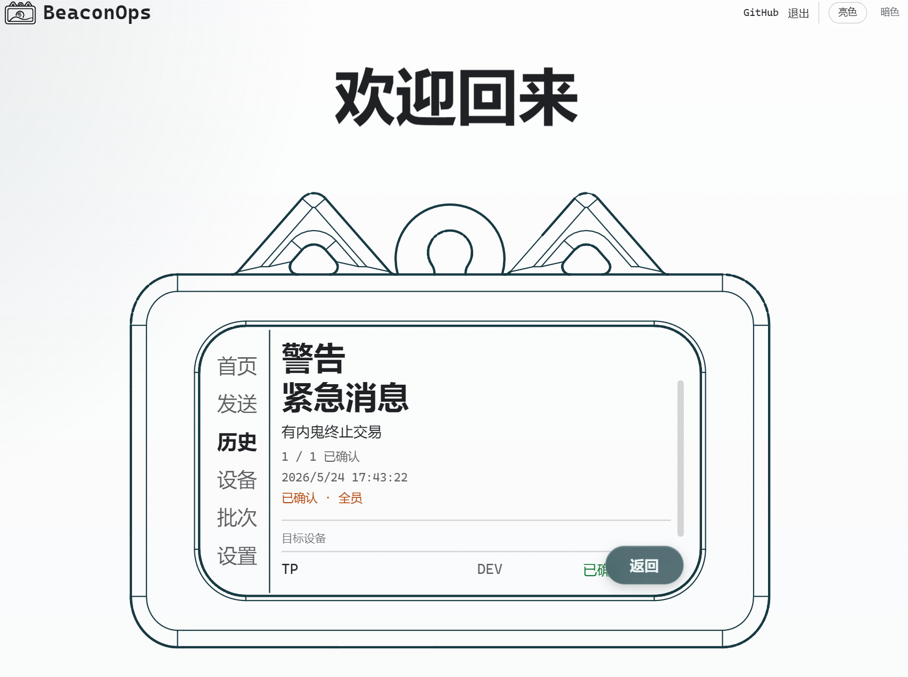
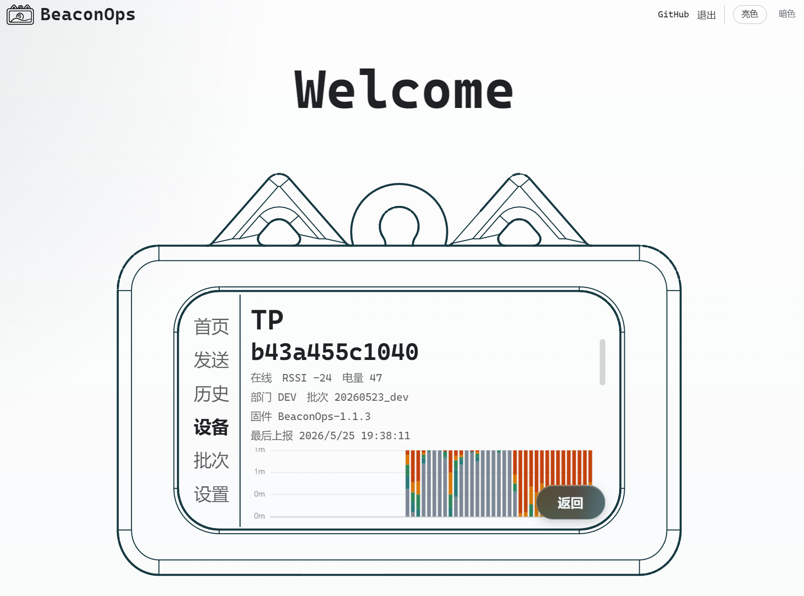
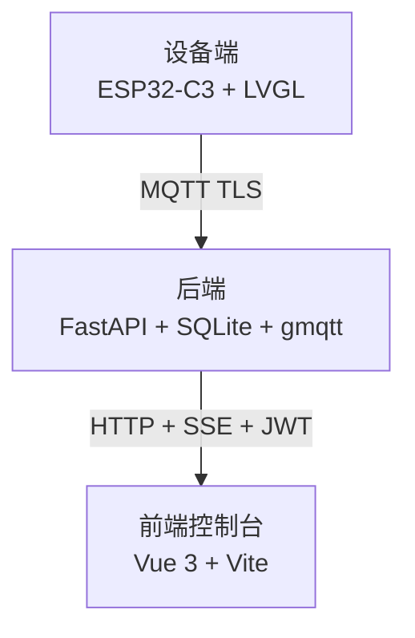

<div align="center">


# BeaconOps

面向 Beacon 终端的消息发布与设备管理控制台

<p>
    <a href="README_EN.md">English README</a> ·
    <a href="#快速上手">快速上手</a> ·
    <a href="#docs-里有什么">文档索引</a> ·
    <a href="#开源说明">开源说明</a> ·
    <a href="LICENSE">许可证</a>
</p>

<p>
    
    
    
    
    
    
    
</p>

<strong>ESP32-C3 随身终端 · MQTT TLS 下行消息 · Web 控制台实时回执</strong>

</div>

---

## 这是什么

BeaconOps 是一套**自研硬件 + 后端 + Web 控制台**的小型 IoT 项目，主要做一件事：

> 在控制台上写一条消息，按下"发送"，1秒内挂在身上的小设备就响起来、把消息显示在屏上。收到后摇一摇，设备把确认回执发回服务器，控制台实时更新消息状态。

设备本身基于 ESP32-C3，UI 跑 LVGL 9.3；后端是 FastAPI + SQLite + gmqtt 的单进程，对前端讲 HTTP，对设备讲 MQTT；前端是 Vue 3 + Vite + TypeScript 写的管理面板。

这套东西比较适合**不能或不方便用手机**的场景：校内不允许学生带手机的环境、洁净车间 / 产线不允许带手机进工作区、集训 / 研学 / 大型活动中需要统一发指令的临时性分组。设备不需要 SIM 卡、不能聊天、不能装 App，就是一个随身挂着的专用接收和确认终端。

<table>
<tr>
<td width="25%"><strong>端到端</strong><br/><sub>硬件、固件、后端、前端一起开源</sub></td>
<td width="25%"><strong>低打扰</strong><br/><sub>只收指令和确认，不做泛聊天设备</sub></td>
<td width="25%"><strong>可追踪</strong><br/><sub>ACK、event、health、profile 都可落库</sub></td>
<td width="25%"><strong>可复刻</strong><br/><sub>PCB、外壳、烧录脚本和部署文档都在仓库里</sub></td>
</tr>
</table>

---

## 看起来是这样

### 设备

<table>
<tr>
<td align="center" width="50%">
<br/>
<sub>设备首页 · 时间 · 步数 · 设备号</sub>
</td>
<td align="center" width="50%">
<br/>
<sub>收到下行消息 · 摇一摇确认</sub>
</td>
</tr>
</table>

### Web 控制台

<table>
<tr>
<td align="center" width="33%">
<br/>
<sub>首页 · 发送 / 历史 / 设备 / 批次 / 设置</sub>
</td>
<td align="center" width="33%">
<br/>
<sub>消息详情 · 级别 / 状态 / 确认回执</sub>
</td>
<td align="center" width="33%">
<br/>
<sub>设备详情 · 行为时间轴 / 步数 / 活动强度</sub>
</td>
</tr>
</table>

### PCB

<table>
<tr>
<td align="center" width="33%">
<br/>
<sub>实物板 · ESP32-C3 + W25Q128</sub>
</td>
<td align="center" width="33%">
<br/>
<sub>走线图 · 两层板</sub>
</td>
<td align="center" width="33%">
<br/>
<sub>背面 3D 渲染 · USB-C / 电池 / 喇叭</sub>
</td>
</tr>
</table>

---

## 为什么做这个

那天我正在想毕设做点什么，翻来翻去，从抽屉里翻出去年画的一块 PCB——焊好了、调过了，去年还古法编程写了一部分驱动；抽屉里同时还躺着 [pocket](../pocket/) 项目剩下的一只 3D 打印外壳（朋友寄给我的）。板子有了、壳子有了、驱动写了一半，那就拼起来做点有用的东西吧，于是有了 BeaconOps。

所以这不是一个从零规划出来的产品，更像是**几块零散的旧件 + 一个想把它们用起来的周末**拼出来的小项目(虽然花了不到10天)。能用，但风格上确实带点"凑起来的"味道——如果你也有类似的"想把旧件用起来"的冲动，欢迎参考这个项目的结构和实现细节，拿去改改就能用。

---

## 由哪几块组成

<table>
<tr>
<td align="center" width="33%">
<strong>设备端</strong><br/>
<code>ESP32-C3</code> · <code>LVGL</code> · <code>FreeRTOS</code><br/>
<sub>显示消息、播放提示音、摇一摇确认</sub>
</td>
<td align="center" width="33%">
<strong>后端</strong><br/>
<code>FastAPI</code> · <code>SQLite</code> · <code>gmqtt</code><br/>
<sub>鉴权、下发、重试、审计、实时流</sub>
</td>
<td align="center" width="33%">
<strong>Web 控制台</strong><br/>
<code>Vue 3</code> · <code>Vite</code> · <code>ECharts</code><br/>
<sub>发送消息、看设备、管批次、查日志</sub>
</td>
</tr>
</table>



| 模块 | 技术栈 | 位置 |
|---|---|---|
| 固件 | ESP-IDF v5.x · ESP32-C3 · LVGL 9.3 · FreeRTOS | [src/Hardware/Firmware/](src/Hardware/Firmware/) |
| PCB | 嘉立创专业版（双层板，主器件 QFN-32 / WSON-8 / LGA-14） | [src/Hardware/PCB/](src/Hardware/PCB/) |
| 外壳 | STL + 3DM（复用自 [pocket](../pocket/hardware/)） | [src/Hardware/Enclosure/](src/Hardware/Enclosure/) |
| 烧录脚本 | Windows bat + spiffsgen | [src/Hardware/Scripts/](src/Hardware/Scripts/) |
| 后端 | Python 3.11 · FastAPI · aiosqlite · gmqtt · PyJWT · bcrypt | [src/Backend/](src/Backend/) |
| 前端 | Vue 3.5 · Vite 6 · TypeScript 5 · Pinia · Element Plus · ECharts | [src/Frontend/](src/Frontend/) |

---

## 这里面具体在做什么

| 方向 | 已落地内容 |
|---|---|
| 硬件 | ESP32-C3 双层板、外置 SPI flash、IMU、电量计、I²S 功放、ST7789 屏幕、锂电池供电 |
| 固件 | LVGL UI、自定义中文字库、消息级别、摇一摇 ACK、NVS 重试队列、health/profile 上报 |
| 协议 | MQTT TLS、HMAC-SHA256 动态密码、nonce 防重放、上下行 topic 白名单校验 |
| 后端 | FastAPI 管理 API、gmqtt bridge、SQLite 状态、Cookie + CSRF、SSE 实时推送 |
| 前端 | Vue 控制台、设备行为图、消息历史、批次管理、管理员与审计页面 |

### PCB

板子是在嘉立创专业版里自己画的双层板。主芯片是 ESP32-C3（QFN-32），旁边贴一颗 Winbond W25Q128JV 做外置 SPI flash，封装是 WSON-8。

上面这几颗还算好，真正麻烦的是两颗无引脚器件：

- 姿态感知的 ST LSM6DS3TR-C 是 LGA-14，14 个焊盘全藏在芯片底部，上板后看不见焊点，只能靠贴片机 / 热风台的位置精度保证可靠接触，偏 0.1 mm 都可能虚焊
- 音频功放 MAX98357AEWL+ 是 WLP-9（1.34×1.34 mm），本质上是芯片裸片 + 9 颗焊球的 BGA 类封装，返修完全依赖 X-Ray，手工场景下出问题几乎只能换一颗

被动器件清一色 0402，最窄的器件焊盘大概 0.2xx mm，手工焊基本只能上热风台/焊台，没经验直接复刻一次报废一块板子是常事。

电源那一路不只是接个 USB 进来就完事：USB-C 和锂电池要做双路切换，锂电池要走独立充电管理 IC，整机再用 DCDC 拉到 3.3 V，USB D+/D- 还要加 ESD 保护。射频部分用的 IPEX 外接天线座，环境差时换外置。

### 固件

ESP-IDF v5.x + FreeRTOS + LVGL 9.3，C 和 C++ 混着写。Flash 按 4 MB 切分区：`nvs` 24 KB、`phy_init` 4 KB、`factory` 2.87 MB、SPIFFS 1 MB；当前 app 镜像大约 2.4 MB，离 `factory` 上限只剩 470 KB 余量，加功能前要先看一眼大小。

启动逻辑集中在 `main/main.cpp` 里：先同步把 GPIO、I²C、IMU、LVGL、背光、NVS、SPIFFS、音频、CW2017 这些基础设施按顺序拉起来；然后 `net_bringup_task` 异步去做 Wi-Fi 连接、SNTP 对时、HMAC 身份计算、MQTT 上线、上下行通道注册；最后 `sensor_task` 单开一个任务处理 IMU 行为事件，不和网络任务互相阻塞。

`components/` 下面 ST7789、LSM6DS3TR-C、CW2017、MAX98357 I²S、PWM 背光、NVS+SPIFFS、MQTT TLS 这些驱动全是自己写的，没拿现成的厂商 demo 直接抄。

固件 UI 用的中文字体是自定义的 MiSans Bold，用一个 Python 脚本从字体文件里按 GB2312 字符集裁出位图字库，产出的 `.c` 文件直接编进固件——不依赖 TrueType 运行时，不依赖 Flash 里的字体文件，字体换版本重新跑脚本就行。

消息分四个级别（`info` / `notice` / `warn` / `emergency`），其中 `warn` 和 `emergency` 在解析阶段会把状态强制置为「需要确认」，不摇一摇就不算收到。摇一摇的回调链是：`sensor_task` 识别到手势 → `msg_on_shake` → 触发 ACK 发布。ACK 写进 NVS 环形缓冲，带指数退避重试；如果重试超限发不出去，会把结果升级成一条 `ack_give_up` event 上报给服务端。

`health` 组件默认每 30 秒推一次心跳，同时设了变化阈值——电量或充电状态变化时提前补发一次，不用等下一个周期。`profile` 的 60 s 行为窗口聚合如果在离线期间产生，会暂存到 SPIFFS，重新上线后补发，不会直接丢。

### 设备和后端怎么通信

走 MQTT 3.1.1 over TLS 1.2，broker 在 8883 端口，CA 用 Let's Encrypt 的 ISRG Root X1，PEM 直接编进固件——不走系统证书，省一份配置。

鉴权这一块没用静态密码：每个**批次**（batch）由后端在创建时签发一份 `batch_secret`，设备上线时拿自己的 12 位 hex MAC 当 `username`，`password` 拼成 `<ts>:<nonce>:<HMAC_SHA256(batch_secret, device_id|ts|nonce)>`。服务端容忍 ±300 s 时钟偏差，`nonce` 入库做防重放。批次密钥可以单独轮换、单独吊销，不会牵连到其他批次的设备。

主题分上下行：下行是 `device/{id}/cmd`、`broadcast/all/cmd`、`broadcast/dept/{dept}/cmd`；上行是 `device/{id}/uplink/{ack|event|health|profile}` 和 `device/{id}/status`。服务端用正则 `^device/([0-9a-f]{12})/(status|uplink/...)$` 强校验来源主题，防止越权设备假冒。QoS 上 `ack`/`event`/`profile`/`status` 全用 QoS 1，只有 `health` 心跳走 QoS 0。

### 后端

Python 3.11，主要靠 FastAPI + aiosqlite + gmqtt + PyJWT + bcrypt。一个进程里同时跑两条面：HTTP 对前端（JWT 鉴权），MQTT 对设备（gmqtt 客户端桥到 Mosquitto）。两条面在内存里直接共享同一份 SQLite 状态，不需要再起一个消息总线。

路由按资源拆开：`auth` / `admins` / `audit` / `batches` / `devices` / `messages` / `stream`（SSE 实时推送）。角色三级 `admin` / `operator` / `viewer`，靠 FastAPI 的 `Depends` 在接口入口处校验。管理后台登录走 Cookie + CSRF 双重保护（`csrf_guard` 中间件）。

下行消息的重试不堵 publish 主流程：`messages.py` 里另起一个 `retry_loop`，按 `next_retry_at` 时间到了再丢出去。设备重新上线时会触发 `on_device_online`，把当前还处于 queued/sent 状态的消息立刻补推一次，不需要等下一个重试周期。

批次被吊销时，后端会异步重启 Mosquitto broker——不是等设备下次重连时才发现，而是主动把当前在线的批次设备踢掉。落盘是单文件 SQLite，过期 nonce 和 token 每 10 分钟自动清理一次。

### 前端

Vue 3.5 + Vite 6 + TypeScript 5 + Pinia + Element Plus + ECharts，共 12 个 view：登录、首页、消息列表、消息详情、发送、设备列表、设备详情、批次列表、批次详情、设置（含子页）。

设备详情页里有一张 ECharts 行为时间轴图，展示设备端 60 s 窗口聚合上来的活动数据（步数、活动强度、在线/离线节点）。审计页支持按操作人、操作类型、时间范围过滤。管理员管理页支持增删改查。实时数据走 SSE（后端 `/stream` 路由），消息状态变化、设备 health、设备行为三路都从这里推，不轮询。

---

## 仓库结构

<table>
<tr>
<td width="33%"><strong>docs/</strong><br/><sub>设计过程、落地规格、完工核实</sub></td>
<td width="33%"><strong>images/</strong><br/><sub>README 展示图、PCB 渲染、设备实拍</sub></td>
<td width="33%"><strong>src/</strong><br/><sub>硬件、后端、前端源码与子 README</sub></td>
</tr>
</table>

```
BeaconOps/
├── docs/                设计文档与完工记录
├── images/              README 用到的截图与渲染图
├── src/
│   ├── Hardware/        PCB / 外壳 / 固件 / 烧录脚本
│   ├── Backend/         FastAPI + MQTT 桥接
│   ├── Frontend/        Vue 控制台
│   ├── README.md        src 总览（中文）
│   └── README_EN.md     src 总览（English）
├── LICENSE
└── README.md            本文件
```

每一块都有自己的 README（中英双语），从 [src/README.md](src/README.md) 进去看会比较顺。

---

## docs 里有什么

> 如果只想看最终实现，以 `docs/Completed/` 为准；`docs/Design Document/` 更适合看设计过程和取舍。

```
docs/
├── Design Document/     设计过程文档
│   ├── 草稿/            早期流程梳理与草稿（完整流程、实际流程、流程、草稿）
│   └── 落地/            最终落地的技术规格
│       ├── data-model-v1.md      数据模型与数据库 schema
│       ├── decisions.md          关键设计决策记录
│       ├── firmware-changes-v1.md 固件改造目标与文件级改动说明
│       ├── frontend-v1.md        前端页面与状态管理规格
│       └── protocol-v1.md        协议字段、topic 结构、身份模型
└── Completed/           完工后的核实文档（以真实实现为准）
    ├── 00-完工总览.md             总体完工结论与系统边界
    ├── 01-硬件与固件完工说明.md   硬件接入、引脚映射、固件已落地能力
    ├── 02-服务器完工说明.md       后端接口、鉴权、数据层完工核实
    ├── 03-前端完工说明.md         控制台页面与实时通道完工核实
    ├── 04-协议与数据模型完工说明.md 协议字段与数据库表完工核实
    ├── 05-功能证据索引.md         每项功能映射到可审阅的真实源文件
    ├── 06-系统完整功能总结.md     全系统已具备能力的汇总
    └── 07-系统适用场景分析.md     这套系统适合用在哪类组织和人群
```

`Completed/` 里每一条结论都能落到仓库里的具体文件——写文档时的规则是「没有文件证据就不写进去」，所以拿来当技术参考比草稿更可靠。

---

## 快速上手

按你的兴趣选一条路：

| 你想做什么 | 从哪里开始 |
|---|---|
| 只想跑控制台看看 UI | [src/Frontend/README.md](src/Frontend/README.md) |
| 想跑通后端、能登录、能发消息 | [src/Backend/README.md](src/Backend/README.md) |
| 想编译固件、烧到自己的板子 | [src/Hardware/Firmware/README.md](src/Hardware/Firmware/README.md) |
| 想看 PCB / 外壳，自己打一块 | [src/Hardware/README.md](src/Hardware/README.md) |

设备 ↔ 后端的接口约定（MQTT 主题、HMAC 鉴权、路由前缀等）都集中写在 [src/README.md](src/README.md) 里，**不依赖任何具体的服务器目录布局**。

> ⚠️ **复刻这块板子之前**：QFN + 0.4mm 间距的元件挨得很近，没有热风台和一定的手工焊经验，强烈建议**不要直接复刻**——失败一两次基本等于板子报废。先把外壳/固件/后端/前端这些软件部分看明白，再决定要不要碰 PCB。

---

## 不想自己部署？可以用我这台

> 凭证不会放进公开仓库；如果只是想接一块板子试用，可以单独联系我开一个操作员账号。

如果你只是想拿一块板子玩一下，不想自己搭后端、配 broker、签证书——可以直接接我已经在跑的那台服务器。

你能得到的：
- 一个**操作员**级别的控制台账号（可以发消息、管批次、轮换 secret、改设备备注；不能管理管理员账号、看不到审计日志）
- 服务器域名、MQTT broker 地址和 ISRG Root X1 的 PEM
- 简单几步把固件里 `BROKER_URI` 和你自己创建的批次 secret 填进去就能上线

获取方式（凭证不放在公开仓库里）：
- 📧 邮箱：`tp081215@outlook.com`
- 💬 QQ 群：`1042593321`

说一句你想接入我的服务器、附上你的板子情况，我会把账号、broker 地址和证书发给你。

---

## 开源说明

<table>
<tr>
<td width="50%"><strong>仓库里有</strong><br/>源码、PCB 工程、外壳模型、截图、设计文档、完工核实文档</td>
<td width="50%"><strong>仓库里没有</strong><br/>真实密钥、生产凭证、管理员密码哈希、批次 secret</td>
</tr>
</table>

- 仓库里**不包含**真实的 JWT 密钥、MQTT 凭证、管理员密码哈希、批次 secret——这些都是部署时自己生成的
- 文档里的 broker 地址统一写成占位符 `YOUR_BROKER_HOST`，不暴露我自己的服务器
- PCB 只放工程源文件 `.epro`，Gerber / BOM / 坐标文件请自己在嘉立创专业版里导出，避免版本对不上
- 本仓库采用分层授权：软件代码 AGPL-3.0-only，硬件设计 CERN-OHL-S-2.0，文档与图片 CC BY-SA-4.0
- 上游第三方代码（如 `components/display/lv_v9.3/`、`components/display/lv_port/`）保留各自原始的 README 与许可，不按本仓库的分层授权重新声明

PCB 用了 QFN-32、WSON-8、LGA-14 这类细间距封装，元器件挨得比较近，复刻这块板子的门槛主要不在文件，而在你手上的活，量力而为。

---

## 相关链接

演示视频、长篇讲解、会陆续放在这里（先占位，链接后续补上）：

| 平台 | 链接 |
|---|---|
| QQ 群 | `1042593321` |
| B 站 | _待补_ |
| YouTube | _待补_ |
| X / Twitter | _待补_ |
| 开源广场 | _待补_ |

---

## 许可证

| 范围 | 许可证 |
|---|---|
| 固件、后端、前端、脚本等软件代码 | [AGPL-3.0-only](LICENSE) |
| PCB、外壳等硬件设计文件 | [CERN-OHL-S-2.0](LICENSE) |
| README、docs、images 等文档与媒体 | [CC BY-SA 4.0](LICENSE) |

© 2026 CoCandy
