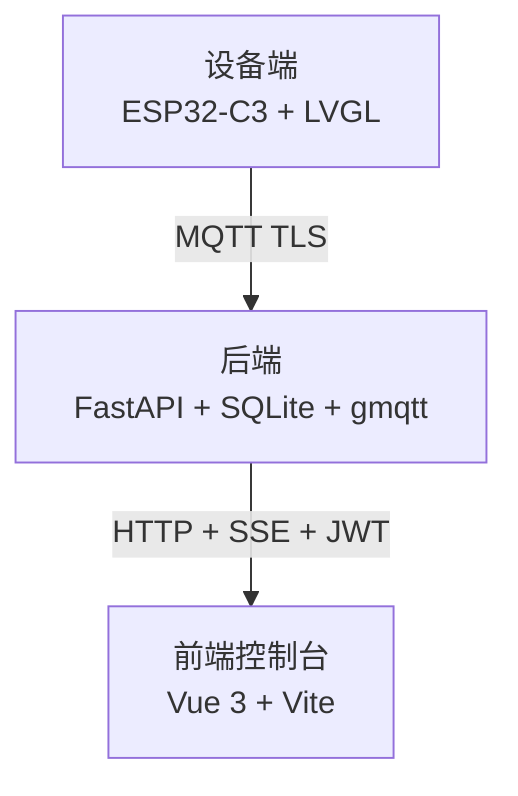

<div align="center">


## 面向随身 Beacon 终端的消息下发与设备管理系统

<p>
    <a href="README_EN.md">English README</a> ·
    <a href="#适合用在哪里">适合场景</a> ·
    <a href="#几个值得关注的设计点">核心能力</a> ·
    <a href="#快速上手">快速上手</a> ·
    <a href="#docs-里有什么">文档索引</a> ·
    <a href="LICENSE">许可证</a>
</p>

<p>
    
    
    
    
    
    
    
</p>

</div>

---

## 这是什么

BeaconOps 是一套完整的小型 IoT 系统，由自研硬件、固件、后端和 Web 控制台四部分组成，全部开源。

核心流程：在控制台写一条消息并发送，挂在身上的设备响起提示音、把消息显示在屏上；收到后摇一摇，设备把确认回执发回服务端，控制台实时看到状态变化。每条消息都有从下发到确认（或放弃）的完整状态追踪。

设备基于 ESP32-C3，带屏幕、扬声器、陀螺仪和锂电池，不需要 SIM 卡，接入 Wi-Fi 即可使用。

---

## 看起来是这样

### 设备

<table>
<tr>
<td align="center" width="50%">
<br/>
<sub>设备首页 · 时间 · 步数 · 设备号</sub>
</td>
<td align="center" width="50%">
<br/>
<sub>收到下行消息 · 摇一摇确认</sub>
</td>
</tr>
</table>

### Web 控制台

<table>
<tr>
<td align="center" width="33%">
<br/>
<sub>首页 · 发送 / 历史 / 设备 / 批次 / 设置</sub>
</td>
<td align="center" width="33%">
<br/>
<sub>消息详情 · 级别 / 状态 / 确认回执</sub>
</td>
<td align="center" width="33%">
<br/>
<sub>设备详情 · 行为时间轴 / 步数 / 活动强度</sub>
</td>
</tr>
</table>

### PCB

<table>
<tr>
<td align="center" width="33%">
<br/>
<sub>实物板 · ESP32-C3 + W25Q128</sub>
</td>
<td align="center" width="33%">
<br/>
<sub>走线图 · 两层板</sub>
</td>
<td align="center" width="33%">
<br/>
<sub>背面 3D 渲染 · USB-C / 电池 / 喇叭</sub>
</td>
</tr>
</table>

---

## 适合用在哪里

这套系统成立的前提是：**有一批人需要接收单向指令或通知，需要有回执确认，但不能或不方便用手机**。

典型场景：

- **校内禁带手机**：需要通知学生或老师，但手机进不了门
- **车间 / 产线禁带手机**：需要向工作区人员传达指令，手机不能进工作区
- **集训 / 研学 / 大型活动**：对临时分组下达指令，需要知道每个人是否真的看到了
- **任何需要"确认收到"的场合**：消息停留在"发出去了"不够，需要显式回执

设备不能聊天、不能装 App，只做接收和确认。这是设计约束，不是功能缺失。

---

## 几个值得关注的设计点

### 消息可靠投递

一条消息从发出到确认，走的是完整的状态链，不是"发出去就算了"：

1. **控制台发送** → 服务端记录消息，状态置为 `queued`，通过 MQTT 下发给设备，状态变为 `sent`
2. **设备收到** → 播放提示音、显示消息，向服务端发 `delivered` ACK，状态变为 `delivered`；消息显示到屏幕时再发 `displayed` ACK
3. **摇一摇确认** → 设备发 `acknowledged` ACK，服务端状态变为 `acknowledged`；超时未确认则变为 `expired`
4. **状态变化实时可见** → 每次状态变更都经 SSE 推到控制台，不需要刷页面

ACK 的投递本身也有可靠性保障：摇一摇触发后，ACK 先写进 NVS 持久化环形缓冲，再由独立的 `tx` 组件按**指数退避**逐条投递（基础延迟 2 秒，退避上限 5 分钟，最多重试 10 次）。NVS 存的是 Flash，设备重启后待发队列仍然有效，继续投。重试彻底失败后不是静默丢弃，而是向服务端上报 `ack_give_up` 事件，让服务端知道这条 ACK 的投递链断在了哪里。

服务端侧：设备重新上线时，`on_device_online` 立刻把处于 `queued` / `sent` 状态的消息再推一次，不等重试周期。

### 设备离线期间数据不丢

两类数据用了不同的持久化策略：

- **ACK 待发队列** → NVS（Flash），重启后继续有效
- **profile 行为窗口** → SPIFFS（每个 60 秒窗口一个文件，最多积压 200 条）

重连后自动排空积压，不需要手动触发。设备短暂断网或意外重启，两类数据都不会丢。

### 健康上报与行为上报分开设计

`health`（运维快照）和 `profile`（行为聚合）是两个独立的上行通道，服务不同的消费目的：

**health**：每 30 秒一次，另设变化阈值触发（电量变化 ≥3% 或 RSSI 变化 ≥10dBm 立刻补发）。字段包含电量、充电状态、RSSI、uptime、ACK 积压数、SPIFFS 积压数——给运维人员判断设备是否需要干预用。

**profile**：60 秒滚动窗口，累加步数、静止 / 慢走 / 快走 / 跑步时长和活动强度，窗口结束时上报。控制台的设备详情页展示为行为时间轴图，给管理人员看设备侧的实际活动状态。

### 批次管理与接入鉴权

同一批设备共享一个 `batch_uuid` 和 `batch_secret`，烧录进固件出厂。设备上线时不使用静态密码，而是用 `batch_secret` 做 HMAC-SHA256 动态密码（格式 `<ts>:<nonce>:<HMAC>`），服务端校验签名、校验 nonce 防重放、校验时钟偏差在 ±300s 内。没有合法批次凭证的设备无法通过 broker 鉴权，网络上的未授权设备接不进来。

设备号来自芯片 MAC eFuse，运行时读取，同批设备烧同一份固件，不需要逐台生成唯一 ID。

批次同时作为管理边界：`produced_count` 是接入的硬约束，超了拒接；批次撤销后服务端异步重启 Mosquitto，主动踢掉当前在线的该批次设备，不等自然重连超时；单台 disable 与整批撤销是正交的两个操作，互不影响。

### 消息原生支持中文

固件内嵌 MiSans 字体（按 GB2312 字符集裁剪编译进固件），不依赖运行时字体文件，屏幕可以直接渲染中文标题和正文。消息内容在控制台以普通文本输入，中英文混排均可正常显示。

### 硬件：36.28×19.39mm 里塞了什么

这块板的尺寸是 36.28×19.39mm，在这个面积里同时集成了：

| 功能 | 芯片 / 方案 |
|---|---|
| 主控 | ESP32-C3，QFN-32 |
| 屏幕驱动 | ST7789，172×320 IPS，SPI |
| 姿态感知 | ST LSM6DS3TR-C，LGA-14（14 个焊盘在底部，上板后不可见） |
| 音频功放 | MAX98357AEWL+，WLP-9（1.34×1.34mm，BGA 类封装） |
| 电量计 | CW2017，I2C |
| 外置 Flash | Winbond W25Q128JVPIQ |
| 充放电管理 | 独立充电 IC + 电源路径切换 IC |
| 降压 | DCDC 3.3V，USB ESD 保护 |

固件分区按 4MB Flash 规划；如果自行制板，可以直接使用 ESP32-C3 FH4（内置 4MB Flash）替换外置 W25Q128，减少一颗焊接器件。

ESP32-C3 在这块板上可以使用的 GPIO 一共 13 路（GPIO 11–17 被内置 Flash 占用，GPIO 18–19 是 USB D±，均不可复用）。这 13 路全部分配：I2S 音频 3 路、I2C 共享总线 2 路、SPI 屏幕 4 路、背光 PWM 1 路、充电状态检测 2 路、其他控制 1 路，没有剩余。

电源路径切换在硬件层完成。USB-C 在位时优先走 USB 供电，断开后自动切回电池，插着充电同时正常运行，固件只读充电状态，不参与路径切换。

---

## 由哪几块组成



| 模块 | 技术栈 | 位置 |
|---|---|---|
| 固件 | ESP-IDF v5.x · ESP32-C3 · LVGL 9.3 · FreeRTOS | [src/Hardware/Firmware/](src/Hardware/Firmware/) |
| PCB | 嘉立创专业版（双层板，QFN-32 / WSON-8 / LGA-14） | [src/Hardware/PCB/](src/Hardware/PCB/) |
| 外壳 | STL + 3DM（复用自 [pocket](../pocket/hardware/)） | [src/Hardware/Enclosure/](src/Hardware/Enclosure/) |
| 烧录脚本 | Windows bat + spiffsgen | [src/Hardware/Scripts/](src/Hardware/Scripts/) |
| 后端 | Python 3.11 · FastAPI · aiosqlite · gmqtt · PyJWT · bcrypt | [src/Backend/](src/Backend/) |
| 前端 | Vue 3.5 · Vite 6 · TypeScript 5 · Pinia · Element Plus · ECharts | [src/Frontend/](src/Frontend/) |

---

## 为什么做这个

那年我正在想毕设做什么，从抽屉里翻出去年画的一块 PCB——焊好了、调过了，写了一部分驱动；抽屉里同时还躺着 [pocket](../pocket/) 项目剩下的一只 3D 打印外壳。板子有了，壳子有了，驱动写了一半，那就拼起来做点有用的东西。于是有了 BeaconOps。

这不是从零规划出来的产品，是**几块旧件拼起来**的小项目，开发时间不到十天。如果你也有"手上有块板子想用起来"的冲动，欢迎参考这里的结构和实现细节。

---

## 仓库结构

```
BeaconOps/
├── docs/                设计文档与完工记录
├── images/              README 截图与渲染图
├── src/
│   ├── Hardware/        PCB / 外壳 / 固件 / 烧录脚本
│   ├── Backend/         FastAPI + MQTT 桥接
│   ├── Frontend/        Vue 控制台
│   ├── README.md        src 总览（中文）
│   └── README_EN.md     src 总览（English）
├── LICENSE
└── README.md            本文件
```

每一块都有自己的 README（中英双语），从 [src/README.md](src/README.md) 进去看比较顺。

---

## docs 里有什么

> 如果只想看最终实现，以 `docs/Completed/` 为准；`docs/Design Document/` 更适合看设计过程和取舍。

```
docs/
├── Design Document/     设计过程文档
│   └── 落地/            最终落地的技术规格
│       ├── data-model-v1.md        数据模型与数据库 schema
│       ├── decisions.md            关键设计决策记录
│       ├── firmware-changes-v1.md  固件改造目标与改动说明
│       ├── frontend-v1.md          前端页面与状态管理规格
│       └── protocol-v1.md          协议字段、topic 结构、身份模型
└── Completed/           完工核实文档（以真实实现为准）
    ├── 00-完工总览.md
    ├── 01-硬件与固件完工说明.md
    ├── 02-服务器完工说明.md
    ├── 03-前端完工说明.md
    ├── 04-协议与数据模型完工说明.md
    ├── 05-功能证据索引.md
    ├── 06-系统完整功能总结.md
    └── 07-系统适用场景分析.md
```

`Completed/` 的每一条结论都能对应到仓库里的具体文件——写的规则是"没有文件证据不写进去"，用来当技术参考比草稿更可靠。

---

## 快速上手

按你的兴趣选一条路：

| 你想做什么 | 从哪里开始 |
|---|---|
| 只想跑控制台看看 UI | [src/Frontend/README.md](src/Frontend/README.md) |
| 想跑通后端、能登录、能发消息 | [src/Backend/README.md](src/Backend/README.md) |
| 想编译固件、烧到自己的板子 | [src/Hardware/Firmware/README.md](src/Hardware/Firmware/README.md) |
| 想看 PCB / 外壳，自己打一块 | [src/Hardware/README.md](src/Hardware/README.md) |

设备 ↔ 后端的接口约定（MQTT 主题、HMAC 鉴权格式、路由前缀等）集中写在 [src/README.md](src/README.md)。

> ⚠️ **复刻这块板子之前**：LGA-14 和 WLP-9 这类无引脚封装，没有回流焊设备和一定经验，强烈建议先把软件部分看明白，再决定要不要碰 PCB。

---

## 不想自己部署？可以用我这台

如果只是想拿一块板子接入试用，不想自己搭后端、配 broker、签证书，可以接我已经在跑的那台服务器。

你能得到的：
- 一个**操作员**级别的控制台账号（发消息、管批次、轮换 secret、改设备备注；看不到审计日志，不能管理管理员账号）
- 服务器域名、MQTT broker 地址、ISRG Root X1 PEM
- 把固件里 `BROKER_URI` 和你创建的批次 secret 填进去，重烧即可上线

联系方式（凭证不放公开仓库）：
- 邮箱: `tp081215@outlook.com`
- QQ 群：`1042593321`

---

## 开源说明

<table>
<tr>
<td width="50%"><strong>仓库里有</strong><br/>源码、PCB 工程、外壳模型、截图、设计文档、完工核实文档</td>
<td width="50%"><strong>仓库里没有</strong><br/>真实密钥、生产凭证、管理员密码哈希、批次 secret</td>
</tr>
</table>

- 文档里的 broker 地址统一写成占位符 `YOUR_BROKER_HOST`，不暴露服务器
- PCB 只放工程源文件 `.epro`，Gerber / BOM / 坐标文件请在嘉立创专业版里自行导出，避免版本对不上
- 本仓库采用分层授权：软件代码 AGPL-3.0-only，硬件设计 CERN-OHL-S-2.0，文档与图片 CC BY-SA-4.0
- 上游第三方代码（`components/display/lv_v9.3/`、`components/display/lv_port/`）保留各自原始许可，不受本仓库分层授权约束

---

## 相关链接

| 平台 | 链接 |
|---|---|
| QQ 群 | `1042593321` |
| B 站 | _待补_ |
| YouTube | _待补_ |
| X / Twitter | _待补_ |
| 开源广场（立创） | [oshwhub.com/httppp/project_owrzrbgf](https://oshwhub.com/httppp/project_owrzrbgf) |

---

## 许可证

| 范围 | 许可证 |
|---|---|
| 固件、后端、前端、脚本等软件代码 | [AGPL-3.0-only](LICENSE) |
| PCB、外壳等硬件设计文件 | [CERN-OHL-S-2.0](LICENSE) |
| README、docs、images 等文档与媒体 | [CC BY-SA 4.0](LICENSE) |

© 2026 CoCandy
