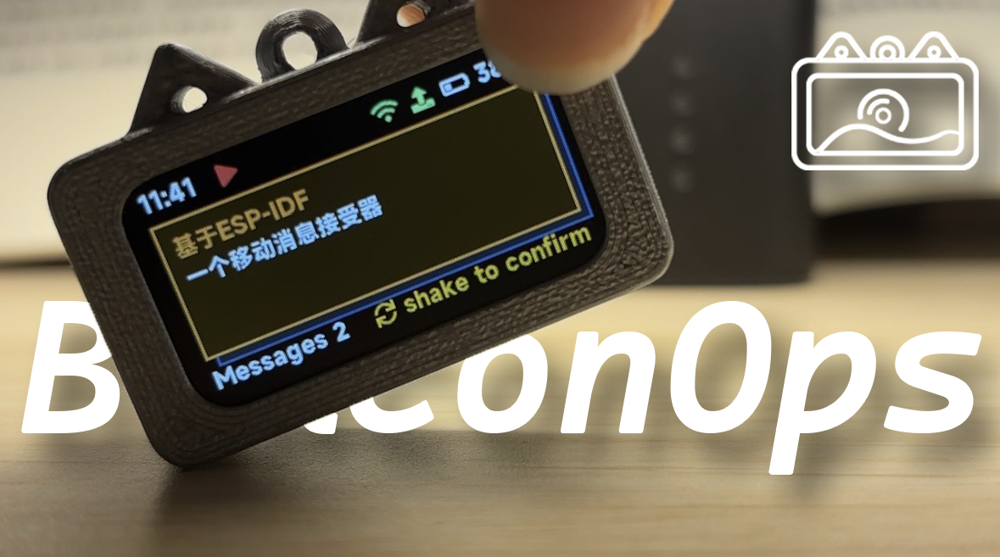
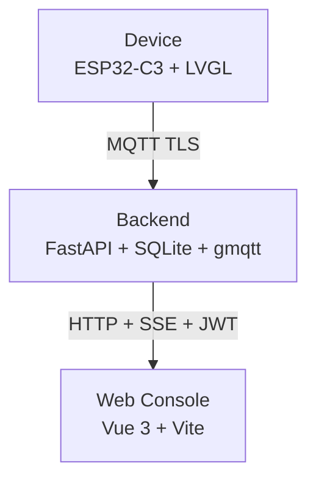

<div align="center">



## Message delivery and device management for wearable Beacon terminals

<p>
    <a href="README.md">中文 README</a> ·
    <a href="#where-it-fits">Use cases</a> ·
    <a href="#a-few-design-choices-worth-noting">Core design</a> ·
    <a href="#getting-started">Getting started</a> ·
    <a href="#whats-in-docs">Docs index</a> ·
    <a href="LICENSE">License</a>
</p>

<p>
    
    
    
    
    
    
    
</p>

</div>

---

## What is this

BeaconOps is a complete small-scale IoT system consisting of custom hardware, firmware, a backend, and a web console — all open source.

Core flow: write a message in the console and send it; the wearable device plays a chime and displays the message on screen; the recipient shakes the device to confirm, which sends an acknowledgement back to the server; the console sees the status update in real time. Every message has full state tracking from delivery to acknowledgement (or expiry).

The device is based on the ESP32-C3 with a screen, speaker, gyroscope, and Li-Po battery. No SIM card required — Wi-Fi only.

---

## What it looks like

### Device

<table>
<tr>
<td align="center" width="50%">
<br/>
<sub>Home screen · Time · Step count · Device ID</sub>
</td>
<td align="center" width="50%">
<br/>
<sub>Incoming message · Shake to acknowledge</sub>
</td>
</tr>
</table>

### Web Console

<table>
<tr>
<td align="center" width="33%">
<br/>
<sub>Home · Send / History / Devices / Batches / Settings</sub>
</td>
<td align="center" width="33%">
<br/>
<sub>Message detail · Level / Status / ACK receipts</sub>
</td>
<td align="center" width="33%">
<br/>
<sub>Device detail · Activity timeline / Steps / Intensity</sub>
</td>
</tr>
</table>

### PCB

<table>
<tr>
<td align="center" width="33%">
<br/>
<sub>Physical board · ESP32-C3 + W25Q128</sub>
</td>
<td align="center" width="33%">
<br/>
<sub>Routing · Two-layer board</sub>
</td>
<td align="center" width="33%">
<br/>
<sub>Back 3D render · USB-C / Battery / Speaker</sub>
</td>
</tr>
</table>

---

## Where it fits

This system makes sense when: **a group of people need to receive one-way instructions or notifications, need to confirm receipt, but cannot or should not use phones**.

Typical scenarios:

- **Phone-banned school environments**: need to notify students or staff, but phones aren't allowed on site
- **Factory floors / cleanrooms**: need to relay instructions to workers in areas where phones are prohibited
- **Training camps / field trips / large events**: dispatch instructions to temporary sub-groups and verify each person actually saw the message
- **Any situation where "sent" isn't enough**: you need an explicit acknowledgement, not just delivery

The device cannot send messages, cannot run apps, and is not a chat device. That is a design constraint, not a limitation.

> For a more detailed scenario analysis, see [docs/Completed/07-系统适用场景分析.md](docs/Completed/07-系统适用场景分析.md) (Chinese)

---

## A few design choices worth noting

### Reliable message delivery

A message follows a complete state chain from send to confirmation — it's not "fire and forget":

1. **Console sends** → server records the message as `queued`, pushes it to the device via MQTT, status becomes `sent`
2. **Device receives** → plays a chime, displays the message, sends a `delivered` ACK; sends another `displayed` ACK once the message is rendered on screen
3. **Shake to confirm** → device sends `acknowledged` ACK, server status becomes `acknowledged`; if not confirmed within the timeout, status becomes `expired`
4. **Status changes are visible in real time** → every state transition is pushed to the console via SSE, no page refresh needed

ACK delivery itself is also reliable: after a shake, the ACK is first written to an NVS-backed persistent ring buffer, then delivered by a dedicated `tx` component using **exponential backoff** (base delay 2 s, cap 5 min, up to 10 retries). NVS lives in Flash — the pending queue survives a device reboot and delivery continues. If retries are exhausted, the ACK is not silently dropped; instead, an `ack_give_up` event is reported to the server so it knows exactly where the delivery chain broke.

Server side: when a device comes back online, `on_device_online` immediately re-pushes any messages still in `queued` or `sent` state, without waiting for the next retry cycle.

### Offline data is not lost

Two data types use different persistence strategies:

- **Pending ACK queue** → NVS (Flash), survives reboot
- **Profile behavior windows** → SPIFFS (one file per 60-second window, up to 200 queued)

Both drain automatically after reconnection without manual intervention. A brief disconnection or unexpected reboot drops nothing.

### Health reporting and behavior reporting are separate

`health` (operational snapshot) and `profile` (behavioral aggregation) are two independent uplink channels serving different consumers:

**health**: every 30 seconds, plus threshold-triggered pushes (battery change ≥ 3% or RSSI change ≥ 10 dBm). Fields include battery level, charging state, RSSI, uptime, pending ACK count, and pending SPIFFS count — for ops staff to judge whether a device needs attention.

**profile**: 60-second rolling windows, accumulating step count, time spent static / slow walk / fast walk / running, and activity intensity. Reported at the end of each window and displayed as an activity timeline on the device detail page in the console — for supervisors to view actual activity states.

### Batch management and access authentication

Devices in the same batch share a `batch_uuid` and `batch_secret`, flashed into firmware at the factory. Devices do not use static passwords to connect; instead they generate an HMAC-SHA256 dynamic password from `batch_secret` (format: `<ts>:<nonce>:<HMAC>`). The server validates the signature, checks nonce replay, and enforces a ±300 s clock skew tolerance. Devices without valid batch credentials cannot authenticate with the broker — unauthorized devices on the network cannot connect.

Device IDs come from the chip's MAC eFuse, read at runtime. All devices in a batch flash the same firmware; no per-device unique firmware is needed.

Batches also serve as management boundaries: `produced_count` is a hard cap on connected devices, not a soft statistic; revoking a batch triggers an async Mosquitto restart that actively disconnects all currently online devices in that batch without waiting for natural timeout; per-device disable and per-batch revocation are orthogonal operations that do not affect each other.

### Native Chinese message display

The firmware includes the MiSans font compiled in (a GB2312-subset bitmap, built directly into the firmware image). The display renders Chinese titles and body text without loading any font file at runtime. Message content is entered as plain text in the console; Chinese, English, and mixed text all display correctly.

### Hardware: what fits in 36.28×19.39 mm

The board is 36.28×19.39 mm. Everything below is on it simultaneously:

| Function | Chip / Solution |
|---|---|
| MCU | ESP32-C3, QFN-32 |
| Display driver | ST7789, 172×320 IPS, SPI |
| Motion sensing | ST LSM6DS3TR-C, LGA-14 (all 14 pads on the bottom, invisible after assembly) |
| Audio amplifier | MAX98357AEWL+, WLP-9 (1.34×1.34 mm, BGA-class package) |
| Fuel gauge | CW2017, I2C |
| External Flash | Winbond W25Q128JVPIQ |
| Charge management | Dedicated charger IC + power path switching IC |
| Power | DCDC 3.3 V, USB ESD protection |

The firmware partition layout is designed for 4 MB Flash. If you are making your own PCB, you can use the ESP32-C3 FH4 (built-in 4 MB Flash) and remove the external W25Q128, eliminating one component.

The ESP32-C3 has 13 usable GPIOs on this board (GPIO 11–17 are occupied by internal Flash; GPIO 18–19 are USB D±). All 13 are assigned: 3 for I2S audio, 2 for shared I2C bus, 4 for SPI display, 1 for backlight PWM, 2 for charging state detection, 1 for other control. None remain.

Power path switching is handled entirely in hardware. When USB-C is present, USB power takes priority; disconnecting it switches automatically to battery. The device operates normally while charging. The firmware only reads charging state and does not control the power path.

---

## How it's built



| Module | Stack | Location |
|---|---|---|
| Firmware | ESP-IDF v5.x · ESP32-C3 · LVGL 9.3 · FreeRTOS | [src/Hardware/Firmware/](src/Hardware/Firmware/) |
| PCB | EasyEDA Pro (two-layer, QFN-32 / WSON-8 / LGA-14) | [src/Hardware/PCB/](src/Hardware/PCB/) |
| Enclosure | STL + 3DM (reused from [pocket](../pocket/hardware/)) | [src/Hardware/Enclosure/](src/Hardware/Enclosure/) |
| Flash scripts | Windows bat + spiffsgen | [src/Hardware/Scripts/](src/Hardware/Scripts/) |
| Backend | Python 3.11 · FastAPI · aiosqlite · gmqtt · PyJWT · bcrypt | [src/Backend/](src/Backend/) |
| Frontend | Vue 3.5 · Vite 6 · TypeScript 5 · Pinia · Element Plus · ECharts | [src/Frontend/](src/Frontend/) |

---

## Why this exists

I was thinking about what to do for my thesis project. I pulled an old PCB out of a drawer — soldered, tested, and partially written firmware from the year before. Next to it was a 3D-printed enclosure left over from the [pocket](../pocket/) project. Board ready, enclosure ready, half the drivers written — might as well put them together into something useful. That's how BeaconOps started.

This is not a product designed from scratch. It's a small project assembled from spare parts, built in under ten days. If you have a board sitting around and want to put it to use, feel free to reference the structure and implementation here.

---

## Repository structure

```
BeaconOps/
├── docs/                Design documents and completion records
├── images/              README screenshots and renders
├── src/
│   ├── Hardware/        PCB / Enclosure / Firmware / Flash scripts
│   ├── Backend/         FastAPI + MQTT bridge
│   ├── Frontend/        Vue console
│   ├── README.md        src overview (Chinese)
│   └── README_EN.md     src overview (English)
├── LICENSE
└── README.md            This file
```

Each module has its own README (Chinese and English). Start from [src/README.md](src/README.md) for an overview.

---

## What's in docs/

> For the final implementation, refer to `docs/Completed/`. `docs/Design Document/` is better for understanding design decisions and trade-offs.

```
docs/
├── Design Document/
│   └── 落地/            Finalized technical specs
│       ├── data-model-v1.md        Data model and DB schema
│       ├── decisions.md            Key design decision records
│       ├── firmware-changes-v1.md  Firmware modification targets
│       ├── frontend-v1.md          Frontend pages and state management spec
│       └── protocol-v1.md          Protocol fields, topic structure, identity model
└── Completed/           Post-completion verification docs (based on actual implementation)
    ├── 00-完工总览.md
    ├── 01-硬件与固件完工说明.md
    ├── 02-服务器完工说明.md
    ├── 03-前端完工说明.md
    ├── 04-协议与数据模型完工说明.md
    ├── 05-功能证据索引.md
    ├── 06-系统完整功能总结.md
    └── 07-系统适用场景分析.md
```

Every conclusion in `Completed/` maps to a specific file in the repository — the rule when writing them was "no file evidence, don't include it." More reliable as technical reference than the drafts.

---

## Getting started

Pick a path based on what you want to do:

| What you want | Where to start |
|---|---|
| Just run the console UI | [src/Frontend/README.md](src/Frontend/README.md) |
| Run the backend, log in, send messages | [src/Backend/README.md](src/Backend/README.md) |
| Build firmware and flash your own board | [src/Hardware/Firmware/README.md](src/Hardware/Firmware/README.md) |
| Look at PCB / enclosure, print your own | [src/Hardware/README.md](src/Hardware/README.md) |

Device ↔ backend interface contracts (MQTT topics, HMAC auth format, route prefixes) are documented in [src/README.md](src/README.md).

> ⚠️ **Before replicating this board**: LGA-14 and WLP-9 are leadless packages. Without reflow equipment and experience, strongly recommend getting familiar with the software side first before committing to PCB assembly.

---

## Don't want to self-host? Use my server

If you just want to connect a board and try it out without setting up your own backend, broker, and certificates, you can connect to my running instance.

What you get:
- An **operator-level** console account (send messages, manage batches, rotate secrets, rename devices; no access to audit logs or admin management)
- Server hostname, MQTT broker address, ISRG Root X1 PEM
- Fill in `BROKER_URI` in the firmware and your batch secret, reflash, and you're live

Contact (credentials are not in the public repo):
- 📧 `tp081215@outlook.com`
- 💬 QQ group: `1042593321`

---

## Open-source notes

<table>
<tr>
<td width="50%"><strong>What's in the repo</strong><br/>Source code, PCB project, enclosure models, screenshots, design docs, completion verification docs</td>
<td width="50%"><strong>What's not in the repo</strong><br/>Real keys, production credentials, admin password hashes, batch secrets</td>
</tr>
</table>

- Broker addresses in all docs are written as the placeholder `YOUR_BROKER_HOST`
- PCB contains only the EasyEDA Pro source file `.epro`; export Gerber / BOM / pick-and-place yourself to avoid version mismatch
- This repo uses layered licensing: software code under AGPL-3.0-only, hardware design under CERN-OHL-S-2.0, docs and media under CC BY-SA 4.0
- Upstream third-party code (`components/display/lv_v9.3/`, `components/display/lv_port/`) retains its original license and is not subject to this repo's layered licensing

---

## Links

| Platform | Link |
|---|---|
| QQ group | `1042593321` |
| Bilibili | [【开源】BeaconOps & 一股强劲的音乐袭来](https://b23.tv/ga6vSr7) |
| YouTube | _TBD_ |
| X / Twitter | _TBD_ |
| OSHWHub | [oshwhub.com/httppp/project_owrzrbgf](https://oshwhub.com/httppp/project_owrzrbgf) |

---

## License

| Scope | License |
|---|---|
| Firmware, backend, frontend, scripts | [AGPL-3.0-only](LICENSE) |
| PCB, enclosure and other hardware design files | [CERN-OHL-S-2.0](LICENSE) |
| README, docs, images and other documentation | [CC BY-SA 4.0](LICENSE) |

© 2026 CoCandy
