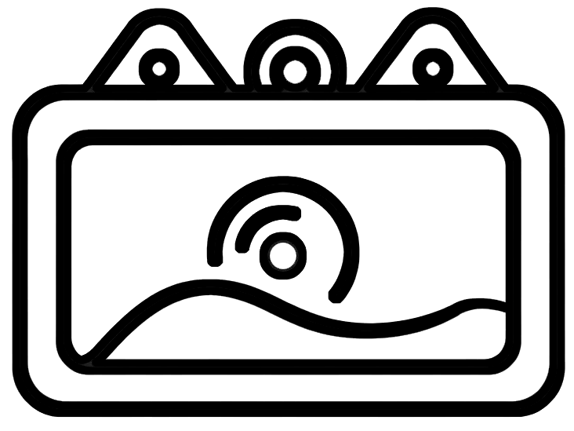
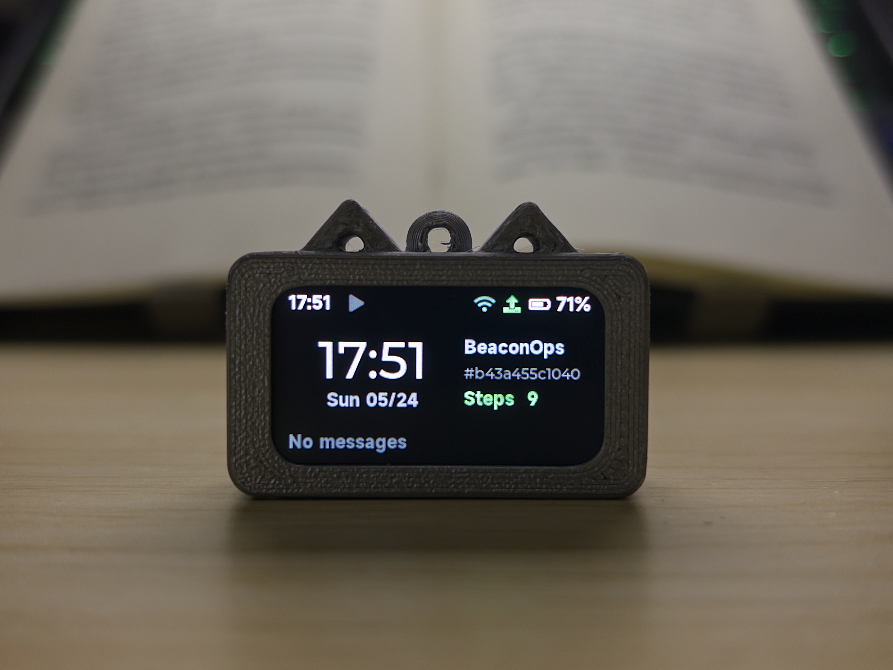
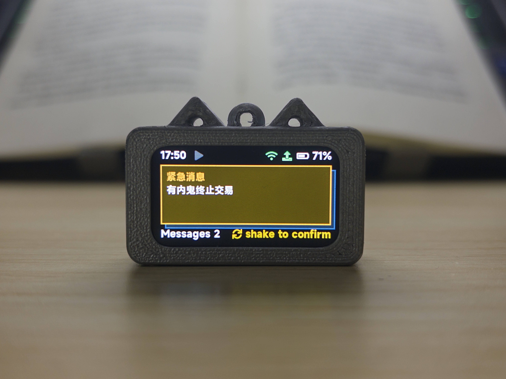
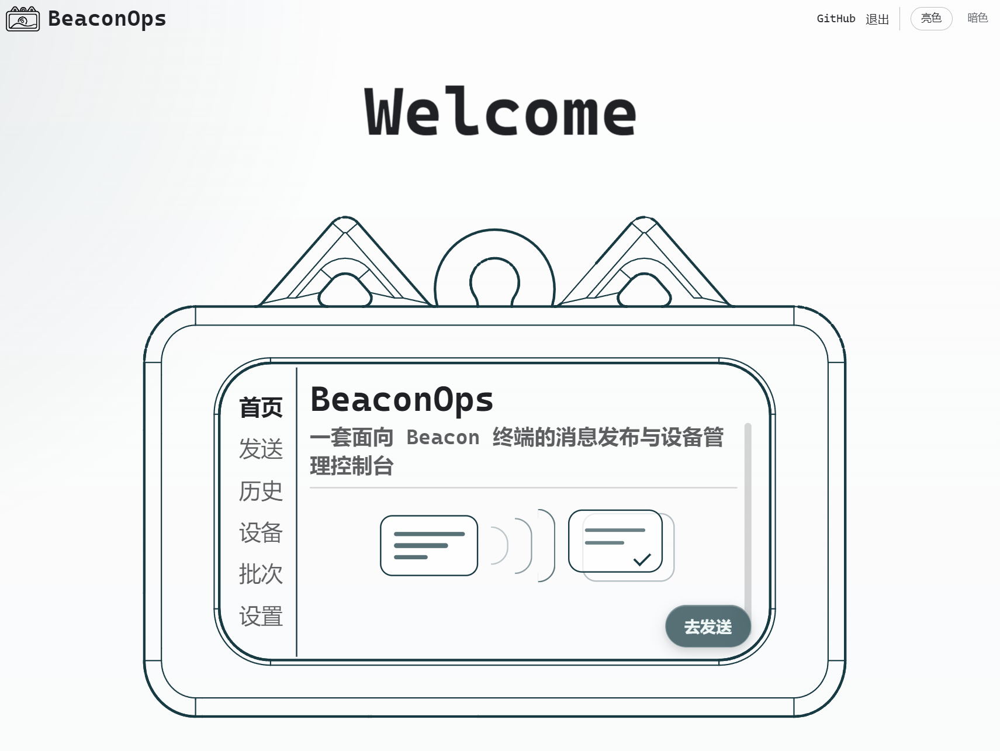
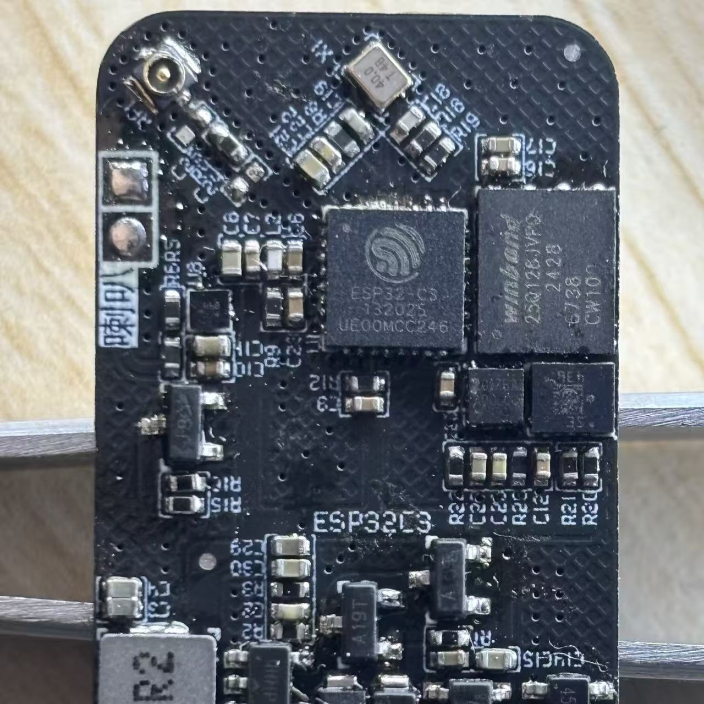
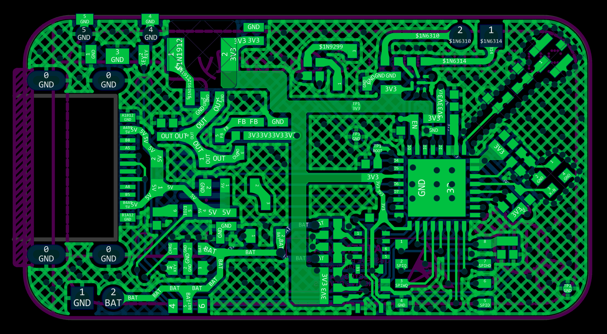
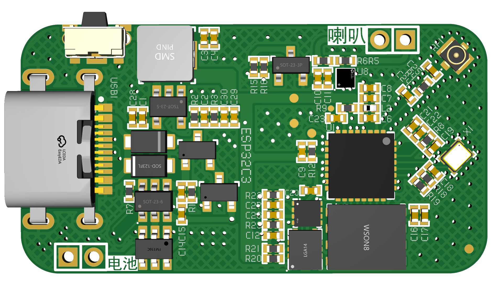

<div align="center">



# BeaconOps

Message dispatch and device management console for Beacon terminals

[中文 README](README.md) · [Open-source notes](#open-source-notes) · [License](LICENSE)

</div>

---

## What is this

BeaconOps is a small IoT project built around **custom hardware + a backend + a web console**, and it does one thing:

> Write a message in the console, hit Send — the wearable device rings and shows the message within a second. The recipient shakes the device to confirm receipt; the confirmation is sent back to the server, and the console updates the message status in real time.

The device runs on an ESP32-C3 with LVGL 9.3 for the UI. The backend is a single FastAPI + SQLite + gmqtt process that speaks HTTP to the frontend and MQTT to devices. The frontend is a Vue 3 + Vite + TypeScript management panel.

This setup is a good fit for **environments where phones are not allowed or practical**: schools that ban student phones on campus, cleanrooms and factory floors with no-phone policies, temporary groups in camps, research trips, or large-scale events where instructions need to go out to everyone at once. The device requires no SIM card, can't chat, can't install apps — it's a dedicated wearable receive-and-confirm terminal.

---

## What it looks like

### Device

<table>
<tr>
<td align="center" width="50%">
<br/>
<sub>Home screen · time · step count · device ID</sub>
</td>
<td align="center" width="50%">
<br/>
<sub>Incoming message · shake to confirm</sub>
</td>
</tr>
</table>

### Web console

<p align="center">
<br/>
<sub>Send / history / devices / batches / settings</sub>
</p>

### PCB

<table>
<tr>
<td align="center" width="33%">
<br/>
<sub>Assembled board · ESP32-C3 + W25Q128</sub>
</td>
<td align="center" width="33%">
<br/>
<sub>Routing · two-layer board</sub>
</td>
<td align="center" width="33%">
<br/>
<sub>Back-side 3D render · USB-C / battery / speaker</sub>
</td>
</tr>
</table>

---

## Why this exists

I was trying to figure out what to do for my graduation project. Rummaging around, I pulled a PCB I had designed the year before out of a drawer — already assembled, already debugged, with some drivers I had written the old-fashioned way. In the same drawer sat a 3D-printed enclosure left over from the [pocket](../pocket/) project (a friend had printed it for me). Board, enclosure, half-written drivers — might as well put them together and build something useful. That's how BeaconOps happened.

So this isn't a product planned from scratch. It's more like **a few spare parts + a weekend of wanting to use them** — though it actually took under ten days. It works; I wear it every day. The construction does have a "cobbled together" feel, which is fine — if you've ever had the urge to do something with leftover parts, the structure and implementation here should give you a decent starting point.

---

## How it's structured

```
Device (ESP32-C3, LVGL)
    │  MQTT (TLS)
    ▼
Backend (FastAPI + SQLite + gmqtt)
    │  HTTP (JWT)
    ▼
Frontend console (Vue 3 + Vite)
```

| Module | Stack | Location |
|---|---|---|
| Firmware | ESP-IDF v5.x · ESP32-C3 · LVGL 9.3 · FreeRTOS | [src/Hardware/Firmware/](src/Hardware/Firmware/) |
| PCB | EasyEDA Pro (two-layer, main ICs: QFN-32 / WSON-8 / LGA-14) | [src/Hardware/PCB/](src/Hardware/PCB/) |
| Enclosure | STL + 3DM (reused from [pocket](../pocket/hardware/)) | [src/Hardware/Enclosure/](src/Hardware/Enclosure/) |
| Flash scripts | Windows bat + spiffsgen | [src/Hardware/Scripts/](src/Hardware/Scripts/) |
| Backend | Python 3.11 · FastAPI · aiosqlite · gmqtt · PyJWT · bcrypt | [src/Backend/](src/Backend/) |
| Frontend | Vue 3.5 · Vite 6 · TypeScript 5 · Pinia · Element Plus · ECharts | [src/Frontend/](src/Frontend/) |

---

## What's actually going on inside

### PCB

The board is a two-layer design drawn in EasyEDA Pro. The main chip is an ESP32-C3 (QFN-32), with a Winbond W25Q128JV for external SPI flash in a WSON-8 package.

Those are manageable. The two tricky ones are the leadless parts:

- The ST LSM6DS3TR-C IMU is LGA-14: all 14 pads are hidden under the chip body. You can't see the solder joints after reflow — positional accuracy from a pick-and-place or hot-air station is what keeps the connections reliable. A 0.1 mm shift can produce a cold joint.
- The MAX98357AEWL+ audio amp is WLP-9 (1.34 × 1.34 mm): a bare die with 9 solder balls — effectively a BGA-class package. Rework requires X-Ray; in a hand-soldering context a bad joint usually means replacing the part.

Passive components are all 0402; the tightest pad spacing is around 0.4 mm. Hand-soldering basically requires a hot-air station with flux, and it's normal to lose a board on the first attempt without prior experience.

The power circuit is more than just plugging in USB: USB-C and the Li-Po battery need dual-path switching, the battery needs a dedicated charge management IC, the whole board runs through a DC-DC converter to 3.3 V, and the USB D+/D- lines need ESD protection. The RF section uses an IPEX U.FL connector so you can swap in an external antenna when the environment demands it.

### Firmware

ESP-IDF v5.x + FreeRTOS + LVGL 9.3, written in a mix of C and C++. Flash is partitioned across 4 MB: `nvs` 24 KB, `phy_init` 4 KB, `factory` 2.87 MB, SPIFFS 1 MB. The current app image is around 2.4 MB, leaving roughly 470 KB of headroom before hitting the `factory` partition ceiling — worth checking before adding features.

Boot logic lives in `main/main.cpp`: GPIO, I²C, IMU, LVGL, backlight, NVS, SPIFFS, audio, and CW2017 are all initialized synchronously in order. Then `net_bringup_task` runs asynchronously: Wi-Fi, SNTP time sync, HMAC identity construction, MQTT connection, and up/downlink channel registration. Finally, `sensor_task` runs as its own FreeRTOS task handling IMU behavior events, isolated from the network task.

All peripheral drivers in `components/` — ST7789, LSM6DS3TR-C, CW2017, MAX98357 I²S, PWM backlight, NVS+SPIFFS, MQTT TLS — are written from scratch, not copied from vendor demos.

The firmware UI uses a custom MiSans Bold bitmap font. A Python script extracts glyphs from the font file against the GB2312 character set and outputs a `.c` file that gets compiled directly into the firmware — no TrueType runtime, no font file on Flash. Updating the font means re-running the script.

Messages have four levels: `info`, `notice`, `warn`, and `emergency`. At parse time, `warn` and `emergency` are force-set to "requires acknowledgement" — the device considers them unconfirmed until the user shakes it. The shake callback chain is: `sensor_task` detects the gesture → `msg_on_shake` → ACK published. ACKs are written to an NVS ring buffer and retried with exponential backoff. If retries are exhausted, the result is escalated as an `ack_give_up` event uploaded to the server.

The `health` component sends a heartbeat every 30 seconds by default, plus a threshold-triggered extra packet when battery level or charging state changes — no waiting for the next cycle. `profile` 60-second behavior windows that accumulate while offline are written to SPIFFS and uploaded after reconnection; nothing is silently dropped.

### Device ↔ backend protocol

Transport: MQTT 3.1.1 over TLS 1.2, broker on port `8883`, CA = Let's Encrypt ISRG Root X1. The PEM is compiled into the firmware directly — no system trust store, no separate config step.

Authentication uses per-batch HMAC rather than a static password. The backend issues a `batch_secret` when a batch is created. At connection time the device uses its 12-hex-digit MAC as `username` and constructs `password` as `<ts>:<nonce>:<HMAC_SHA256(batch_secret, device_id|ts|nonce)>`. The server tolerates a ±300 s clock skew and stores `nonce` values to prevent replay. Batch keys can be rotated or revoked independently without affecting other batches.

Topic structure:
- Downlink (server → device): `device/{id}/cmd`, `broadcast/all/cmd`, `broadcast/dept/{dept}/cmd`
- Uplink (device → server): `device/{id}/uplink/{ack|event|health|profile}`, `device/{id}/status`

The server validates incoming topics against `^device/([0-9a-f]{12})/(status|uplink/...)$` to block impersonation. QoS: `ack`/`event`/`profile`/`status` use QoS 1; `health` heartbeats use QoS 0.

### Backend

Python 3.11 with FastAPI + aiosqlite + gmqtt + PyJWT + bcrypt. A single process handles two surfaces simultaneously: HTTP for the frontend (JWT auth) and MQTT for devices (gmqtt bridging to Mosquitto). Both surfaces share the same SQLite state in memory — no separate message bus needed.

Routes are split by resource: `auth` / `admins` / `audit` / `batches` / `devices` / `messages` / `stream` (SSE). Three roles — `admin` / `operator` / `viewer` — are enforced via FastAPI `Depends` at each endpoint. The management portal login uses Cookie + CSRF double protection (`csrf_guard` middleware).

Downlink retries don't block the publish path: `messages.py` runs a `retry_loop` that fires deliveries when `next_retry_at` is due. When a device reconnects, `on_device_online` immediately re-pushes all messages still in `queued` or `sent` state — no waiting for the next retry window.

When a batch is revoked, the backend asynchronously restarts the Mosquitto broker, actively disconnecting currently-online devices rather than waiting for them to detect the revocation themselves. Persistence is a single-file SQLite; expired nonces and tokens are cleaned up every 10 minutes.

### Frontend

Vue 3.5 + Vite 6 + TypeScript 5 + Pinia + Element Plus + ECharts, 12 views: login, home, message list, message detail, send, device list, device detail, batch list, batch detail, settings (with sub-pages).

The device detail page includes an ECharts behavior timeline chart showing the 60-second windowed activity data uploaded from the device (step count, activity intensity, online/offline events). The audit page supports filtering by actor, action type, and time range. Admin management supports full CRUD. Real-time data comes through SSE (backend `/stream` route) — message status changes, device health, and device behavior all push through there, no polling.

---

## Repository structure

```
BeaconOps/
├── docs/                Design documents and completion records
├── images/              Screenshots and renders used in READMEs
├── src/
│   ├── Hardware/        PCB / enclosure / firmware / flash scripts
│   ├── Backend/         FastAPI + MQTT bridge
│   ├── Frontend/        Vue console
│   ├── README.md        src overview (Chinese)
│   └── README_EN.md     src overview (English)
├── LICENSE
└── README.md            This file (Chinese)
```

Each module has its own README (Chinese + English). Start from [src/README_EN.md](src/README_EN.md) for a guided tour.

---

## What's in docs/

```
docs/
├── Design Document/     Design-phase documents
│   ├── 草稿/            Early flow sketches and drafts
│   └── 落地/            Final technical specs
│       ├── data-model-v1.md       Data model and database schema
│       ├── decisions.md           Key design decisions log
│       ├── firmware-changes-v1.md Firmware refactor targets and file-level changes
│       ├── frontend-v1.md         Frontend page and state management spec
│       └── protocol-v1.md         Protocol fields, topic structure, identity model
└── Completed/           Post-completion verification documents (evidence-based)
    ├── 00-完工总览.md              Overall completion summary and system boundaries
    ├── 01-硬件与固件完工说明.md    Hardware init, pin mapping, firmware capabilities
    ├── 02-服务器完工说明.md        Backend routes, auth, data layer verification
    ├── 03-前端完工说明.md          Console pages and real-time channel verification
    ├── 04-协议与数据模型完工说明.md Protocol fields and database table verification
    ├── 05-功能证据索引.md          Each feature mapped to a reviewable source file
    ├── 06-系统完整功能总结.md      Full capability summary of the live system
    └── 07-系统适用场景分析.md      Who and what this system is suited for
```

Every claim in `Completed/` traces back to a specific source file in the repo — the rule when writing these was "no evidence, don't write it." They're more reliable as a technical reference than the draft documents.

---

## Quick start

Pick the path that matches your interest:

- **Just want to run the console and see the UI** → [src/Frontend/README.md](src/Frontend/README.md)
- **Want a working backend — login, send messages** → [src/Backend/README.md](src/Backend/README.md)
- **Want to build the firmware and flash your own board** → [src/Hardware/Firmware/README.md](src/Hardware/Firmware/README.md)
- **Want the PCB / enclosure files to make a board** → [src/Hardware/README.md](src/Hardware/README.md)

The device ↔ backend interface contract (MQTT topics, HMAC auth, route prefixes) is all in [src/README_EN.md](src/README_EN.md) and doesn't depend on any specific server directory layout.

> ⚠️ **Before replicating the PCB**: QFN + LGA + WLP components are packed close together. Without a hot-air station and some hand-soldering experience, expect to scrap a board on the first attempt. Work through the software side first (enclosure, firmware, backend, frontend) and decide later whether the PCB is worth tackling.

---

## Don't want to self-host? Use my server

If you just want to try the system with a physical board and don't want to set up a backend, configure a broker, or handle certificates — you can connect directly to the server I already have running.

What you get:
- An **operator**-level console account (send messages, manage batches, rotate secrets, update device aliases; no admin account management, no audit log access)
- Server hostname, MQTT broker address, and the ISRG Root X1 PEM
- A few config steps to put your `BROKER_URI` and batch secret into the firmware and you're online

Contact (credentials aren't in the public repo):
- 📧 Email: `tp081215@outlook.com`
- 💬 QQ group: `1042593321`

Send a message saying you want to connect, include your board situation, and I'll send over the account, broker address, and certificate.

---

## Open-source notes

- The repo contains **no** real JWT secrets, MQTT credentials, admin password hashes, or batch secrets — those are generated at deployment time
- Broker addresses in documentation use the placeholder `YOUR_BROKER_HOST`
- The PCB folder contains only the EasyEDA Pro source file `.epro`. Export Gerbers, BOM, and placement files yourself to avoid version mismatches
- Upstream third-party code (e.g. `components/display/lv_v9.3/`, `components/display/lv_port/`) retains its original README and license and is not re-licensed under this repo's MIT

The PCB uses QFN-32, WSON-8, and LGA-14 fine-pitch packages with tight component spacing. The barrier to replicating this board is mainly in the soldering, not the files. Know your limits.

---

## Links

Demo videos, write-ups, and release notes will be posted here (placeholders for now):

| Platform | Link |
|---|---|
| QQ group | `1042593321` |
| Bilibili | _TBD_ |
| YouTube | _TBD_ |
| X / Twitter | _TBD_ |
| Open Source Plaza | _TBD_ |

---

## License

[MIT License](LICENSE) · © 2026 CoCandy
